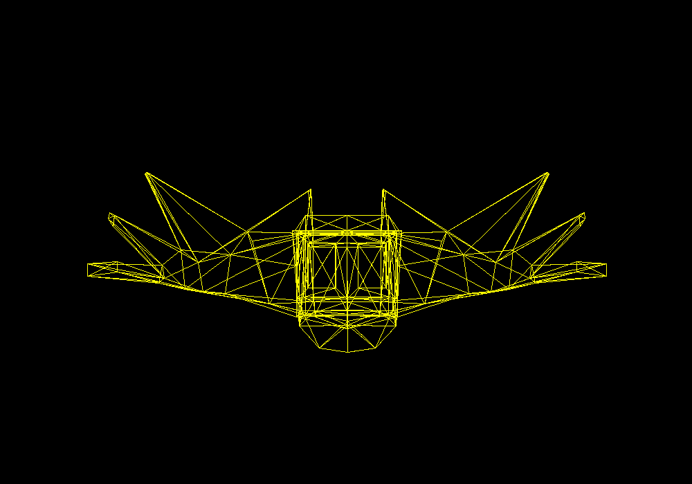

# SpaceTravel #

## Resumen ##

Este repositorio contiene un renderer por software de una simulación de un sistema planetario creada como trabajo del curso. El objetivo del proyecto es diseñar y renderizar un sistema estelar propio usando su motor de pintura de triángulos.

---

## Primera entrega: Carga de modelos

### Imagen del modelo

 
 ---

## Segunda entrega: Sistema planetario y shaders

En la etapa actual se añadieron:

- Shaders específicos por tipo de cuerpo celeste (`Star`, `Mercury`, `Venus`, `Rocky` (Tierra), `Mars`, `GasGiant` (Júpiter), `Moon`).
- Animaciones basadas en tiempo (rotación propia, detalles que “respiran”, patrones dinámicos).
- Órbita de la Luna alrededor de la Tierra.
- Anillos de Júpiter generados por geometría procedimental en CPU y rasterizados en el mismo framebuffer.
- Contornos dibujados por detección de aristas entre caras front/back para resaltar la silueta.

### Video de la simulación actual

https://github.com/user-attachments/assets/652ff6d3-b695-4fa8-9c4a-01786a231f37

---

## Proyecto 3: Space Travel 

En la versión final del proyecto se implementaron las siguientes características para cumplir con los requerimientos de la tarea:

- **Sistema estelar completo en el plano eclíptico**
  - Un **sol** en el origen.
  - Varios planetas alineados al plano eclíptico: Mercurio, Venus, Tierra, Marte y Júpiter.
  - **Luna** orbitando la Tierra.
  - Cada cuerpo tiene **traslación orbital** y **rotación sobre su propio eje**.

- **Cámara con movimiento 3D**

- **Warping animado a diferentes puntos del sistema**
    - Vista general del sistema.
    - Vista enfocada en el Sol.
    - Vista en la órbita de la Tierra.
    - Vista de Marte.
    - Vista de Júpiter.
    - Vista rasante sobre el plano eclíptico.

- **Nave que sigue a la cámara**

- **Skybox / estrellas**

- **Órbitas renderizadas**

### Controles (resumen)

- **Movimiento**: `W`, `A`, `S`, `D` (frente/atrás/lateral), `Q` / `E` (abajo/arriba).
- **Rotación de cámara**:
  - Flechas (`↑`, `↓`, `←`, `→`)  
  - o mouse (activar/desactivar con `M`).
- **Zoom (FOV)**: `Z` / `X`.
- **Warps a vistas clave**: teclas `1`–`6`.
- **Captura de imagen**: `P` guarda `render.png` en la raíz del proyecto.

### Video del sistema solar 

https://github.com/user-attachments/assets/4572163b-bb28-43af-952f-a0ad99f5e00a

